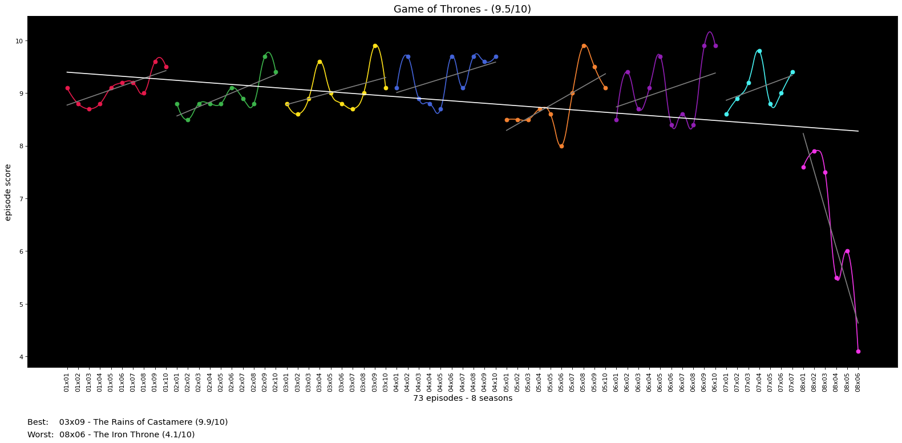
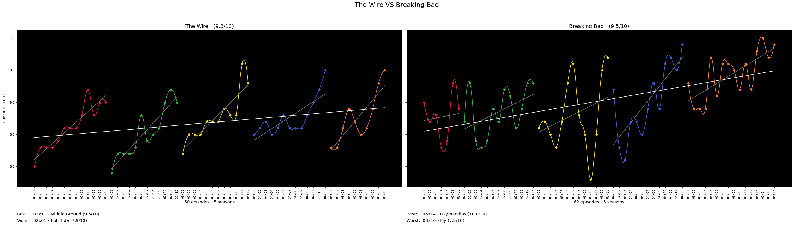
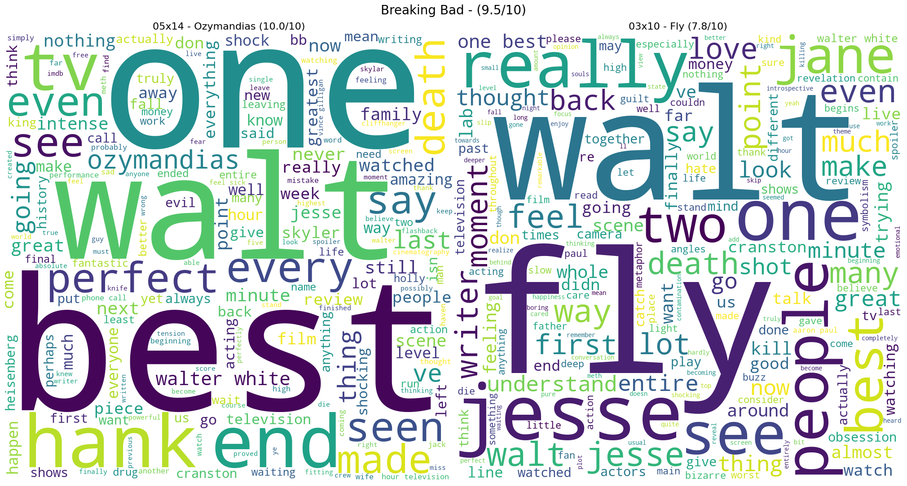

# Visual Media Insights

This repo provides insights on visual media like shows and movies. For example, it can create graphs like this:



And comaprisons like this:



Also it can make word clouds from a show's best and worst episodes IMDB reviews.



## Setup

This repository uses Python 3.7. Ensure you have that installed before
starting. Using a virtual environment is not required, but is highly
recommended.

If you need to get an API key from OMBD, go here: http://www.omdbapi.com/apikey.aspx

```bash
# 1. Clone the repo
git clone <THIS REPO>
cd <THIS REPO>

# 2. Set up virtual environment
python3 -m venv .venv
.venv/bin/activate

# 3. Install reqs
python3 -m pip install -r requirements

# 4. get and export OMDB API Key
# http://www.omdbapi.com/apikey.aspx
export OMDB_API_KEY=<YOUR KEY>

# 5. cd into the app directory and start exploring!
cd vmi
python -m plot.graph "The Wire" 
```

## Usage

**Note:** all commands must be run from the `vmi/` directory.

**Note:** all output images end up in the output directory.

### Graphs

Creating a graph for a single show

```python
python3 -m plot.graph "Show name"

# For example
python3 -m plot.graph "The Wire"
```

Creating a graph for a single season of a show

```python
python3 -m plot.graph "Show name" SEASON_NUM

# For example
python3 -m plot.graph "The Wire" 1
```

Creating a graph that compares two shows

```python
python3 -m plot.graph "Show name" "Other show name"

# For example
python3 -m plot.graph "The Wire" "Breaking Bad"
```

Creating a graph that compares two seasons of the same show

```python
python3 -m plot.graph "Show name" SEASON_NUM SEASON_NUM

# For example
python3 -m plot.graph "The Wire" 1 2
```

Creating a graph that compares two seasons of differnt shows

```python
python3 -m plot.graph "Show name" SEASON_NUM "Other show name" SEASON_NUM

# For example
python3 -m plot.graph "The Wire" 1 "Breaking Bad" 1
```


### Word Clouds

This feature creates word clouds from the reviews for the best and worst
episodes of a particular show or season.

Creating a word cloud for a single show

```python
python3 -m plot.cloud "Show name"

# For example
python3 -m plot.cloud "The Wire"
```

Creating a word cloud for a single show

```python
python3 -m plot.cloud "Show name" SEASON_NUM

# For example
python3 -m plot.cloud "The Wire" 1
```

### Text Based Insights

Viewing insights for a show

```python
python3 -m insights.show "Show name"

# For example
python3 -m insights.show "The Wire"
```
